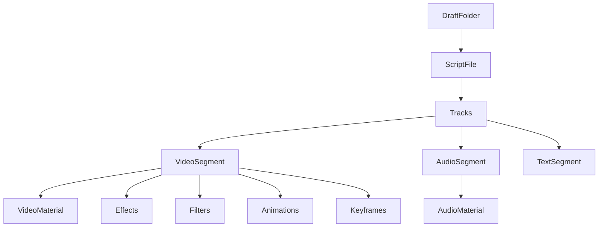

# System Patterns: pyCapCut

## Architecture Overview

```
pycapcut/
├── __init__.py              # Public API exports
├── script_file.py           # Main ScriptFile class - draft management
├── draft_folder.py          # DraftFolder - manages CapCut draft directories
├── template_mode.py         # Template loading and manipulation
├── track.py                 # Track management
├── segment.py               # Base segment class
├── video_segment.py         # Video clip handling
├── audio_segment.py         # Audio clip handling
├── text_segment.py          # Text/subtitle handling
├── effect_segment.py        # Effects on independent tracks
├── local_materials.py       # Material (media file) management
├── animation.py             # Animation definitions
├── keyframe.py              # Keyframe support
├── time_util.py             # Time parsing/conversion utilities
├── jianying_controller.py   # Automation control of CapCut/JianYing
├── exceptions.py            # Custom exceptions
├── util.py                  # General utilities
├── assets/                  # JSON resource files
└── metadata/                # Effect/filter/animation type definitions
```

## Key Design Patterns

### 1. Builder Pattern
Segments and tracks are built incrementally:
```python
script = DraftFolder(path).create_draft("name", 1920, 1080)
script.add_track(TrackType.video)
script.add_segment(VideoSegment(...))
script.save()
```

### 2. Material-Segment Separation
- **Materials**: Reference to source files (VideoMaterial, AudioMaterial)
- **Segments**: Instances of materials on timeline with timing/effects
- One material can be used by multiple segments

### 3. Fluent Interface
Methods return `self` for chaining:
```python
segment.add_animation(...).add_effect(...).add_keyframe(...)
```

### 4. Enum-based Type System
All effects, filters, animations defined as enums in `metadata/`:
- `VideoSceneEffectType`, `AudioSceneEffectType`
- `FilterType`
- `IntroType`, `OutroType`, `GroupAnimationType`
- `TextIntro`, `TextOutro`, `TextLoopAnim`

### 5. Time Abstraction
Dual time representation:
- **Microseconds (int)**: Internal representation
- **String format**: Human-readable ("1.5s", "1m30s")
- `tim()` and `trange()` functions for conversion

## Component Relationships



## Data Flow

1. **Creation**: User creates ScriptFile → adds tracks → adds segments
2. **Assembly**: ScriptFile collects all data into JSON structure
3. **Save**: Writes `draft_content.json` to draft folder
4. **Materials**: Source files copied to draft folder

## Key Technical Decisions

### JSON Structure
- Follows CapCut's internal format for `draft_content.json`
- Materials, segments, tracks have unique IDs (UUIDs)
- Time stored in microseconds

### Template Mode
- Load existing drafts as templates
- Replace materials/text while preserving complex features
- Imported tracks kept separate from new tracks

### Cross-Platform
- Core library works on Linux/MacOS/Windows
- Generated drafts Windows-CapCut-only for export
- UI automation (batch export) Windows-only
